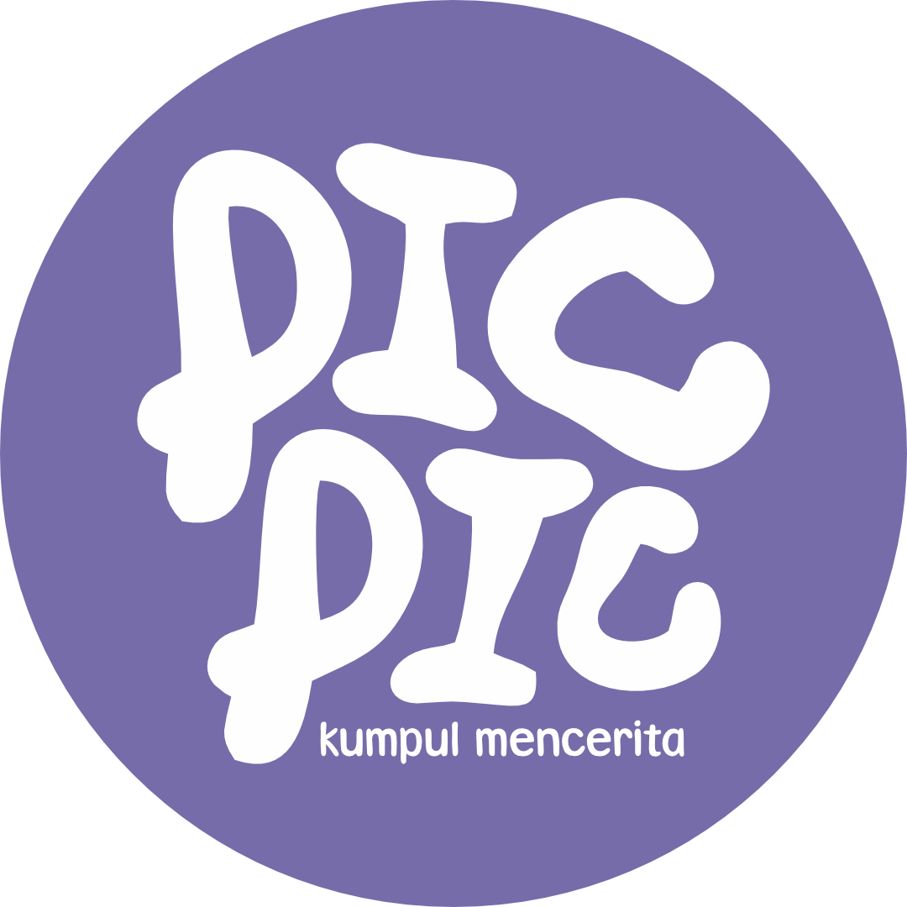

<div align="center">

# 🍵 Picpic Cafe Admin Dashboard


<br/>

<br/>

> 🚀 Modern cafe management system built for speed, simplicity, and scale.
> Dari kasir hingga analytics — semua dalam satu dashboard.

</div>

---

## 🌟 Why Picpic Admin?

- ⚡ Lightning fast dengan Vite + React 19
- 🎨 Clean UI designed in Figma
- 📊 Real-time analytics & reporting
- 🖨️ Bluetooth thermal printer support
- 📱 Responsive — works on tablet & desktop
- 🔐 Secure authentication via Laravel Sanctum
- 🇮🇩 Localized for Indonesian cafe business

---

## ✨ Features

- **📊 Dashboard Analytics:** Pantau performa bisnis, total pesanan, grafik penjualan per jam secara *real-time*.
- **🖥️ Kasir POS (Point of Sale):** Antarmuka kasir cepat dengan perhitungan kembalian otomatis & filter kategori cerdas.
- **🧾 Manajemen Pesanan (Orders):** Kelola status pesanan dari pelanggan, pantau pesanan yang sedang diproses.
- **🍔 Manajemen Menu:** Tambah, edit, hapus, & nonaktifkan ketersediaan menu/produk secara instan.
- **🖼️ Pengaturan Banner:** Ganti banner promosi berjalan untuk aplikasi langsung dari dashboard admin.
- **⚙️ Settings App:** Konfigurasi Profil Kedai, Info Rekening Transfer, dan sinkronisasi hardware *Bluetooth Printer*.
- **🖨️ Cetak Struk Bluetooth:** Interaksi langsung dengan printer kasir via *Web Bluetooth API* tanpa instalasi driver berat.

---

## 🛠️ Tech Stack

- **Frontend Core:** React 18 + TypeScript + Vite
- **Styling:** Tailwind CSS + Lucide React (Icons)
- **Data Fetching:** Axios
- **Charts:** Recharts
- **Backend API:** Laravel 11 + MySQL *(RestAPI terpisah di repo `picpic-cafe`)*

---

## 🚀 Getting Started

### Prerequisites

Pastikan Anda memiliki [Node.js](https://nodejs.org/) (minimal v18) dan [npm](https://www.npmjs.com/) terinstal di mesin lokal.

### Installation

1. **Clone repositori ini:**
   ```bash
   git clone https://github.com/sukunenv/picpic-cafe-admin.git
   cd picpic-cafe-admin
   ```

2. **Instal seluruh *dependencies*:**
   ```bash
   npm install --legacy-peer-deps
   ```

3. **Jalankan *Development Server*:**
   ```bash
   npm run dev
   ```

Akses `http://localhost:5173` dari peramban Anda. *(Sangat disarankan menggunakan Google Chrome atau Edge Chromium untuk mendukung fitur Bluetooth Printer).*

---

## 📱 Pages

Aplikasi ini dibagi menjadi beberapa modul utama untuk memudahkan operasional harian kedai:

- **`/dashboard`** — Tinjauan data harian, ringkasan transaksi, & *chart* performa kedai harian.
- **`/kasir`** — Panel utama kasir untuk memasukkan (*checkout*) pesanan pelanggan dan mencetak struk.
- **`/orders`** — Cek log pesanan, menandai pesanan selesai, atau menolak pesanan.
- **`/menus`** — Atur katalog menu, ubah harga, foto, & stok (Tersedia/Habis).
- **`/banners`** — Pengaturan daftar banner profil promosi.
- **`/settings`** — Panel pengaturan pusat *Admin* (Profil Cafe, Info Transfer Bank, & Hardware).

---

## 🔧 Configuration

### Setup Variabel Lingkungan (API URL)
Dashboard admin ini berkomunikasi dengan Laravel Backend. Pastikan `VITE_API_URL` dikonfigurasi di file `.env`:
```env
# URL Local
VITE_API_URL=http://127.0.0.1:8000/api/v1
```

### Konfigurasi Bluetooth Printer
Struk kedai dicetak mempergunakan *Web Bluetooth API*.
1. Masuk ke halaman **Settings** di dalam Dashboard Admin.
2. Temukan blok **Pengaturan Printer Thermal**.
3. Jika printer Anda menggunakan *Service UUID* khusus, isikan UUID tersebut. Secara otomatis data ini akan tersimpan agar tidak perlu diisi ulang setiap *print*.
4. Anda dapat menyesuaikan ukuran margin cetak dengan memilih opsi **58mm** atau **80mm**.

---

## 👨‍💻 Developer

Built with 🔥 by **Kalify.dev**

---

## 📄 License

**Proprietary — Picpic Cafe © 2026**  
Seluruh hak cipta dilindungi. Penggunaan karya tanpa izin tertulis jelas dilarang.